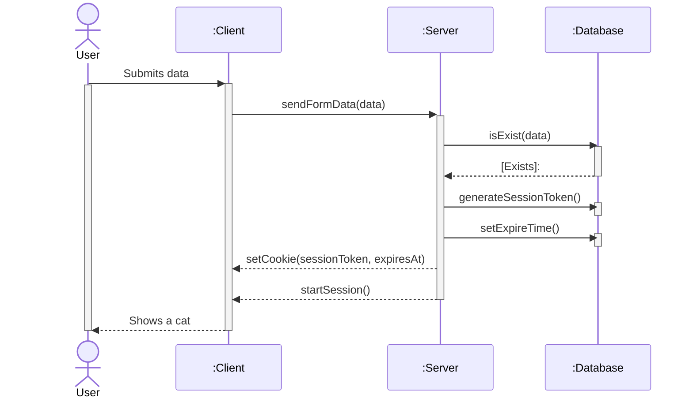

## Successful Log In Diagram

---

```mermaid
sequenceDiagram
    actor U as User
    participant C as :Client
    participant S as :Server
    participant DB as :Database

    U ->>+ C: Submits data
    activate U

    C ->>+ S: sendFormData(data)

    S ->> DB: isExist(data)
    activate DB
    DB -->> S: [Exists]:
    deactivate DB
    S ->> DB: generateSessionToken()
    activate DB
    deactivate DB
    S ->> DB: setExpireTime()
    activate DB
    deactivate DB

    S -->> C: setCookie(sessionToken, expiresAt)
    S -->>- C: startSession()

    C -->>- U: Shows a cat
    deactivate U
```
