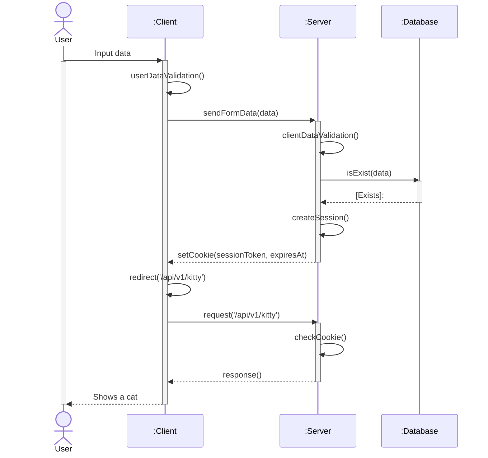

## Successful Log In Diagram

---

```mermaid
sequenceDiagram
    actor U as User
    participant C as :Client
    participant S as :Server
    participant DB as :Database

    U ->>+ C: Input data
    activate U

    C ->> C: userDataValidation()
    C ->>+ S: sendFormData(data)
    S ->> S: clientDataValidation()

    S ->> DB: isExist(data)
    activate DB
    DB -->> S: [Exists]:
    deactivate DB
    S ->> S: createSession()

    S -->> C: setCookie(sessionToken, expiresAt)
    deactivate S

    C ->> C: redirect('/api/v1/kitty')
    
    C ->> S: request('/api/v1/kitty')
    activate S
    S ->> S: checkCookie()
    S -->>- C: response()

    C -->>- U: Shows a cat
    deactivate U
```
