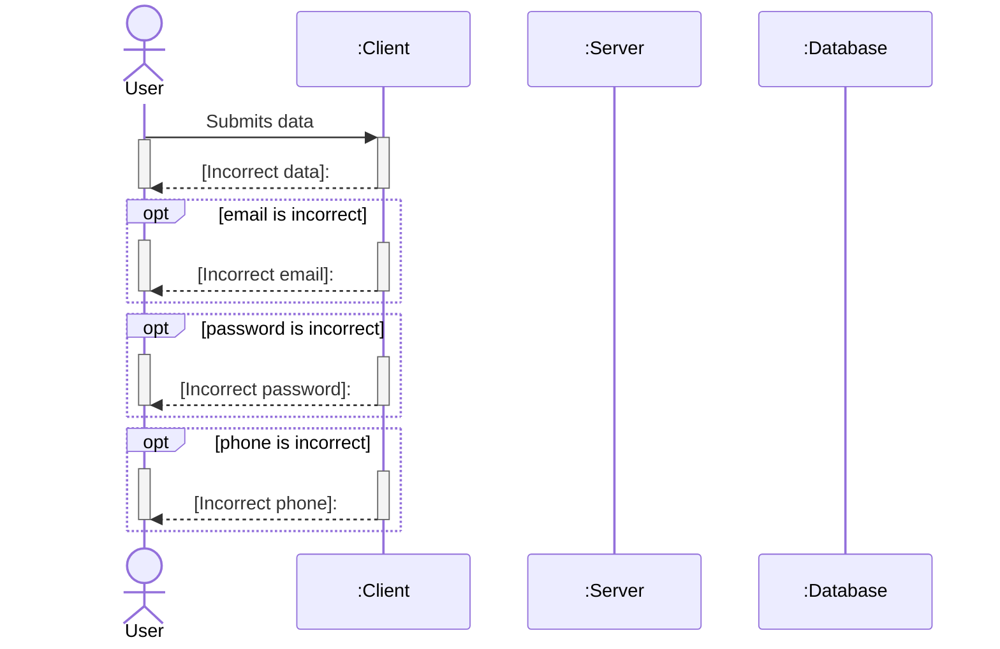
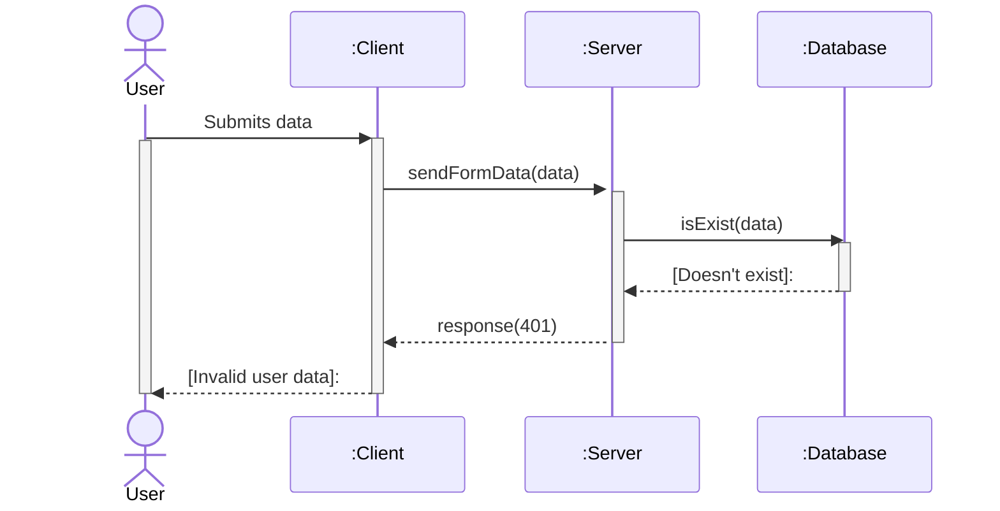

## Unsuccessful Log In Diagrams

---

### **Client validation**

```mermaid
sequenceDiagram
    actor U as User
    participant C as :Client
    participant S as :Server
    participant DB as :Database

    U ->>+ C: Submits data
    activate U
    C -->>- U: [Incorrect data]:
    deactivate U

    opt email is incorrect
        activate U
        activate C
        C -->> U: [Incorrect email]:
        deactivate C
        deactivate U
    end

    opt password is incorrect
        activate U
        activate C
        C -->> U: [Incorrect password]:
        deactivate C
        deactivate U
    end

    opt phone is incorrect
        activate U
        activate C
        C -->> U: [Incorrect phone]:
        deactivate C
        deactivate U
    end
```

### **Server validation**

```mermaid
sequenceDiagram
    actor U as User
    participant C as :Client
    participant S as :Server
    participant DB as :Database

    U ->>+ C: Submits data
    activate U

    C ->>+ S: sendFormData(data)
    activate S

    S ->> DB: isExist(data)
    activate DB

    DB-->> S: [Doesn't exist]:
    deactivate DB

    S -->> C: response(401)
    deactivate S

    C -->> U: [Invalid user data]:
    deactivate C
    deactivate U
```
