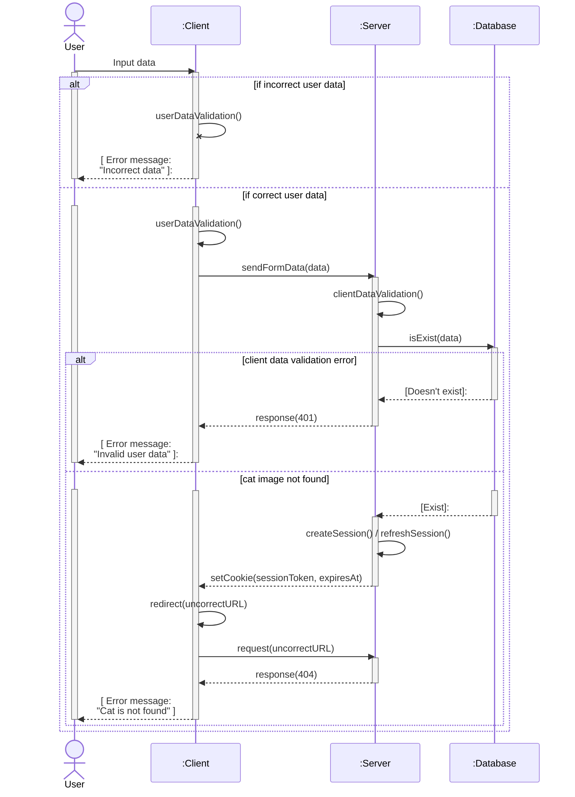

## Unsuccessful Log In Diagrams

---

### **Server validation**

```mermaid
sequenceDiagram
    actor U as User
    participant C as :Client
    participant S as :Server
    participant DB as :Database

    U ->> C: Input data
        activate U
        activate C

    alt if incorrect user data
        C -x C: userDataValidation()
        C -->> U: [ Error message:<br>"Incorrect data" ]:
        deactivate C
        deactivate U

    else if correct user data
        activate U
        activate C
        C ->> C: userDataValidation()
        C ->> S: sendFormData(data)
        activate S 

        S ->> S: clientDataValidation()

        S ->> DB: isExist(data)
        activate DB

        alt client data validation error
            DB-->> S: [Doesn't exist]:
            deactivate DB
        
            S -->> C: response(401)
            deactivate S

            C -->> U: [ Error message:<br>"Invalid user data" ]:
            deactivate C
            deactivate U

        else cat image not found
            activate U
            activate C
            activate DB
            DB-->> S: [Exist]:
            deactivate DB

            activate S
            S ->> S: createSession() / refreshSession()

            S -->> C: setCookie(sessionToken, expiresAt)
            deactivate S
            C ->> C: redirect(uncorrectURL)
            C ->> S: request(uncorrectURL)
            activate S
            S -->> C: response(404)
            deactivate S

           C -->> U: [ Error message:<br>"Cat is not found" ]
            deactivate C
            deactivate U

        end
    end
```
