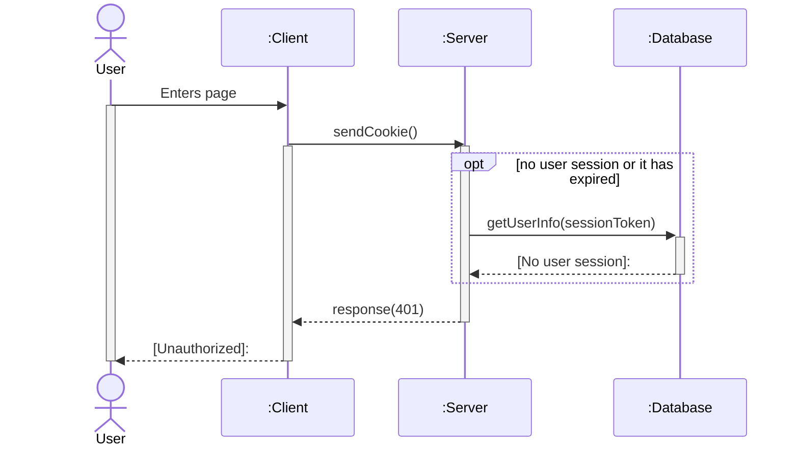

## Unsuccessful Auth For Logged In User

---

```mermaid
sequenceDiagram
    actor U as User
    participant C as :Client
    participant S as :Server
    participant DB as :Database

    U ->> C: Enters page
    activate U

    C ->> S: sendCookie()
    activate C
    activate S

    opt no user session or it has expired
        S ->>+ DB: getUserInfo(sessionToken)
        DB -->>- S: [No user session]:
    end

    S -->> C: response(401)
    deactivate S
    C -->> U: [Unauthorized]:
    deactivate C
    deactivate U
```
